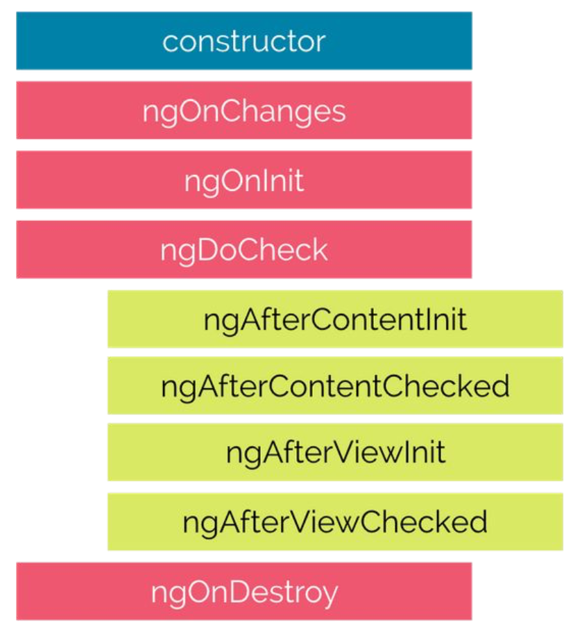

# Lifecycle

Angular manages each component's lifecycle and offers various methods to hook into these events. Each component must implement an interface in order to hook into an event, like so:

```ts
export class MyClass implements OnInit
```

Hook actions are fired automatically – for instance, each time the component would render, an ngOnInit() function would be called.

