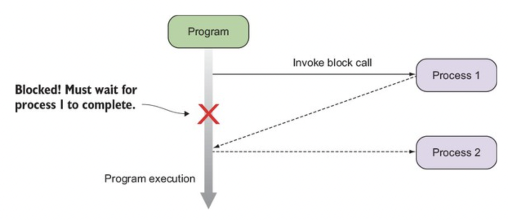
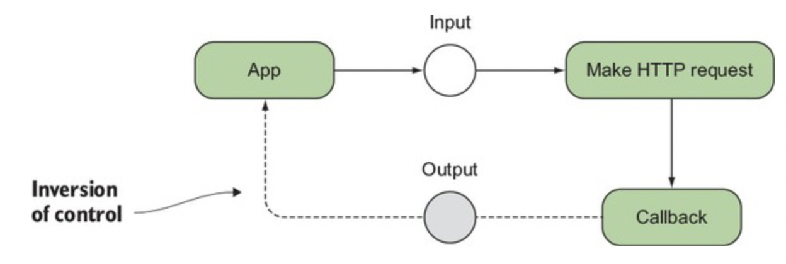
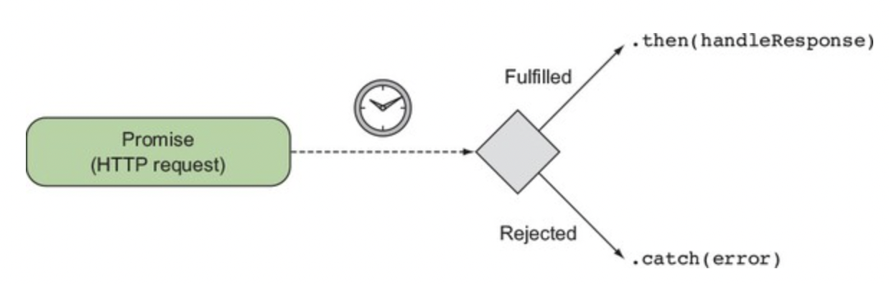
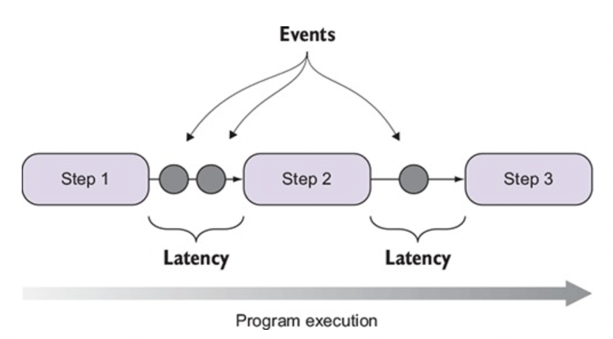

# Observables/RxJS (data drivent development)

RxJS is a library for composing asynchronous and event-based programs by using observable sequences. It provides one core type, the Observable, satellite types (Observer, Schedulers, Subjects) and operators inspired by Array#extras (map, filter, reduce, every, etc) to allow handling asynchronous events as collections.

In most cases:

* Sometimes we want to implement some event based scenarios in our application.
* For this purposes Observable instances are created. They can subscribe to certain events and perform the actions that you define within them.
* RxJS is a standalone library that provides us a defined Observable interface.

A program that invokes two processes synchronously. A process in this case can be as simple as a function call, an I/O process, or a network transaction. When process 1 runs, it blocks anything else from running:

---

Callback functions in JavaScript create an inversion of control where functions call the application back, instead of the other way around.

---

Promises create a flow of calls chained by then methods. If the Promise is fulfilled, the chain of functions continues; otherwise, the error is delegated to the Promise catch block.

---

RxJS can treat asynchronous data flows with a programming model that resembles a simple chain of sequential steps.

Angular let for use to pass data from child to parent. The process when we can pass data from parent to child and from child to parent is called two ways data binding. This is implemented by using RxJS under the hood. Let's look at example:

[https://angular.io/generated/live-examples/two-way-binding/stackblitz.html](https://angular.io/generated/live-examples/two-way-binding/stackblitz.html)
